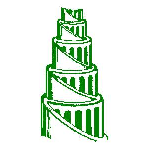

# Four page website
Our coaches assigned us to create a four-page website about a company we invented. The pages needed to be divided amongst the members of the group (4), each needed to design a page. Once finished the pages needed to be joined together on one page and published in one repository.

The project is on Github for the other groups to evaluate the website and to check off all te requirements of the project.

The website needed to have:
- A parralax image header
- Address (if needed)
- Google maps pinned on the location of the company somewhere on the onepager
- A working phone number
- Openinghours (if needed)
- Clickable email
- A working form

The website needed to be: 
- Responsive

## Babylon
Babylon is the company we invented. The company deals with urban farming.

> Babylon is committed to feeding people in a way that is positive for communities and the environment, today and in the future. We build kitchen gardens where people live, which means our produce is fresher, has longer shelf life and shorter food miles.


## Table of content
* [Screenshots](#screenshots)
* [Frameworks](#frameworks)
* [Built with](#built-with)
* [Getting started](#getting-started)
* [Tests](#tests)
* [Credits](#contribution)
* [License](#license)


## Screenshots

*Header with parallax*


git 

## Frameworks
[Bootstrap](https://getbootstrap.com)

## Built with
[Visual Studio Code](https://code.visualstudio.com/)

## Getting started

- We used different **meta-tags** in the HTML-page:
```
    <meta charset="UTF-8" />
    <meta name="description" content="Babylon: Urban Farming">
    <meta name="author" content="Floor,Lennert,Yelena,Sascha">
    <meta name="keywords" content="urban farming,job,urban,design,future,home,farming,city">
    <meta name="viewport" content="width=device-width, initial-scale=1.0" />
    <title>Babylon: Urban Farming</title>
    <meta http-equiv="X-UA-Compatible" content="ie=edge" />
```

- We created our **own logo** with [Photoshop](https://www.photoshop.com/) and added the logo as a favicon.


We started with inventing a company and created four pages that needed to be on the website. 
* [In general](##in-general)
* [Home](##home)
* [About](##about)
* [Services](##services)
* [Contact](##contact)


### Home 


- **Fixed navbar**:

```
.navbar {
  overflow: hidden;
  background-color: white;
  position: fixed;
  width: 100vw;
  border-radius: 5px 5px 5px 5px;
  margin-bottom: 20px;
  top: 0;
  align-items: flex-end;
  color: #000;
  ```

- **Responsive navbar with media queries**:
```
@media only screen and (min-width: 992px) {
  .navbar {
    padding: 0 150px 0 150px;
  }
}
```
- **Logo in navbar**:
```
    <nav class="navbar navbar-expand-lg navbar-light bg-light">
      <a class="navbar-brand" href="#" style="padding-left: 0;">Babylon</a>
      <button class="navbar-toggler" type="button" data-toggle="collapse" data-target="#navbarSupportedContent" aria-controls="navbarSupportedContent" aria-expanded="false" aria-label="Toggle navigation"><span class="navbar-toggler-icon"></span>
      </button>
```

- **Parallax image header**:

```
<div class="parallax site-blocks-cover overlay aos-init aos-animate" data-aos="fade" data-stellar-background-ratio="0.5">
      <div class="container containerheader">
        <div class="row align-items-center justify-content-center text-center">
```

- **An animated button**:
```
  .btn:hover {
    background: #fff;
    color: green;
    box-shadow: 0 5px 15px green;
    -webkit-transform: scale(1.3);
    -ms-transform: scale(1.3);
    transform: scale(1.3);
  }
  ```

- **A transitions in the button**:
 

  ```
   .btn:after {
    content: "";
    background: green;
    display: block;
    position: absolute;
    padding-top: 300%;
    padding-left: 350%;
    margin-left: -35px !important;
    margin-top: -120%;
    opacity: 0;
    transition: all 0.8s;
    border-radius: 30px 30px;
  }

    .btn:active:after {
    padding: 0;
    margin: 0;
    opacity: 1;
    transition: 0s
  }
  
  .btn:focus { outline:0; }
  ```


### About

- **Text alignment**:
```
.about {
  text-align: justify;
  margin-left: -40px;
}
```

### Services

- **3 cards with [Bootstrap Grid System](https://getbootstrap.com/docs/4.0/layout/grid/)**:

```
<div class="col-sm-4 d-flex align-items-stretch">
        <div class="card">
            <div class="card-body">

```

- **Responsive text**:
```
@media only screen and (max-width: 1300px) {
  .squarebrackets {
    width: 100%;
  }
}
```

### Contact

- **Google maps**:
```
 <li><a href="https://goo.gl/maps/CoNHVV2Mhp4BMDHU6"><i class="fa fa-map"><span>Zijpstraat 14</span></i></a></li>

```

- **Clickable e-mail**:
```
<li><a href ="mailto: Babylon@gmail.com"><i class="fa fa-envelope"></i><span>Babylon@gmail.com</span></a></li>

```

- **Working phone number**:
```
<li><a href="tel:+3296304477"><i class="fa fa-phone"></i><span>+32 96 30 44 77</span></a></li>

```


## Project link


## Tests


## Credits
* [Yelena Merzlyakova](https://github.com/YelenaMerzlyakova): **Home** page and overall styling of the website
* [Sascha Goldstein](https://github.com/SaschaGoldstein):  **About** page and invented the company
* [Floor Jules Segers](https://github.com/FloorJulesSegers): **Services** page and the Readme.md
* [Lennert Verreth](https://github.com/LennertVerreth): **Contact** page with Google maps, working phone number and clickable e-mail


## License
[MIT License](https://github.com/YelenaMerzlyakova/Babylon/blob/master/License.txt)
